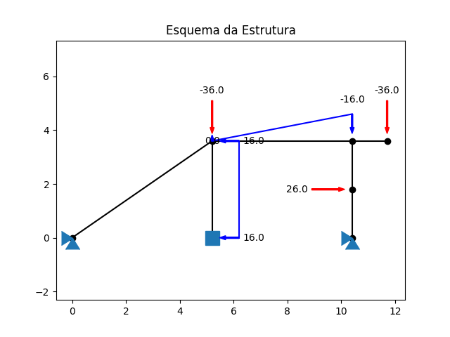
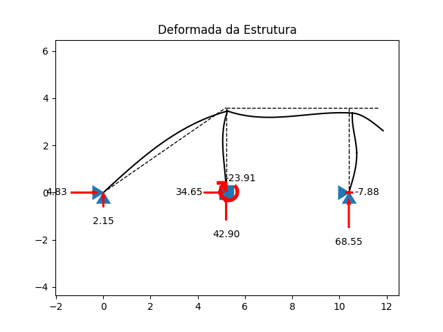
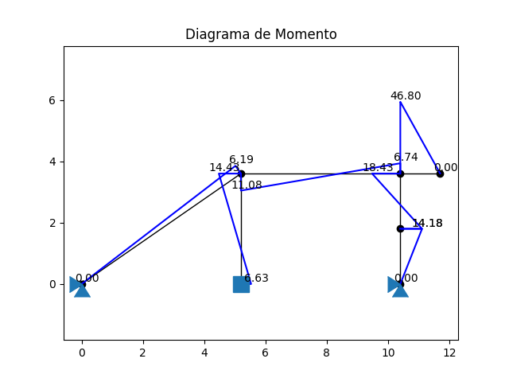
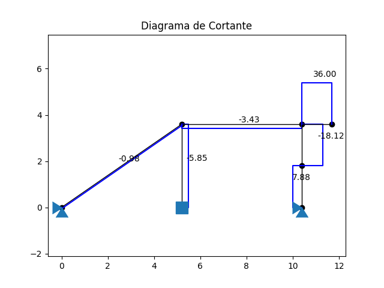
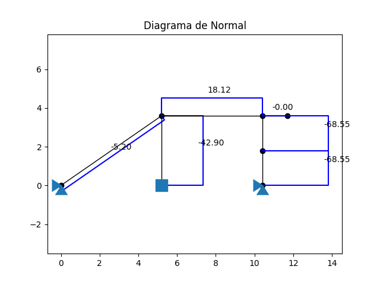

# pyFFEM - Python Frame Finite Element Method

Programa em Python para cálculo de pórticos através do Método dos Elementos Finitos.

Utiliza os polinômios interpoladores cúbicos de Hermite para aproximar os elementos.

## Exemplo

